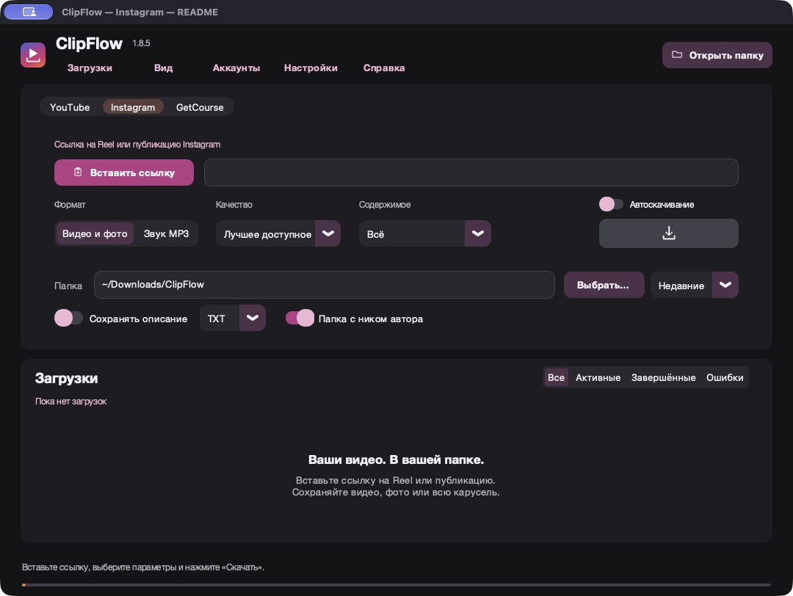

<p align="center">
  
</p>
<h1 align="center">ClipFlow</h1>
<p align="center"><strong>Ваши видео. В вашей папке.</strong><br>Приложение для скачивания видео, аудио и фотографий с YouTube, Instagram и GetCourse.</p>
<p align="center">
  <a href="https://github.com/kirillbronski/clipflow/actions/workflows/check.yml"></a>
  
  
  
</p>
<p align="center"><a href="#возможности">Возможности</a> · <a href="#интерфейс">Интерфейс</a> · <a href="docs/DEVELOPMENT.md">Запуск исходников</a> · <a href="docs/BUILDING.md">Сборка</a> · <a href="https://github.com/kirillbronski/clipflow/releases">Релизы</a></p>

## Возможности

| Сервис | Что можно сохранить |
|---|---|
| **YouTube** | Отдельные видео и плейлисты, MP4 или MP3, выбор качества. |
| **Instagram** | Открытые Reels, посты, фотографии и карусели без входа; все медиа или только видео/фото; полное описание TXT/MD; дополнительная папка с ником автора по переключателю. |
| **GetCourse** | Видео уроков и плееров, выбор материалов урока, скачивание с доступом вашего аккаунта. |

- Очередь загрузок с прогрессом, скоростью и оставшимся временем.
- Пауза, продолжение, отмена и повторная попытка в строке задания.
- Проверка доступного качества и переключатель автоматического скачивания.
- Отдельные папки сервисов, короткие имена файлов и запоминание настроек.
- Три цветовые темы по сервисам, русский и английский интерфейс.
- Встроенное окно входа YouTube с сохранением сессии.
- Защита сохранённых данных через Windows DPAPI или macOS Keychain.

## Интерфейс

Скриншоты сделаны на macOS из общего кода приложения. На Windows используются системные шрифты, диалоги и сочетания клавиш Windows.

### YouTube


### Instagram


### GetCourse


## Установка

Готовые установщики будут публиковаться в [GitHub Releases](https://github.com/kirillbronski/clipflow/releases): Windows — EXE, macOS — DMG. Для готового приложения отдельно устанавливать Python, FFmpeg и Node.js не требуется.

Сборки 1.8.4 были выпущены до объединения исходников. Версия 1.8.5 использует общую кодовую базу, которая проходит отдельные проверки Windows/macOS; статус виден в значке Checks. Установщики собираются из нужного коммита на соответствующей системе. [История изменений](docs/CHANGELOG.md).

**Платформы:** Windows x64; macOS-сборка 1.8.5 — Apple Silicon, macOS 27 и новее. Intel Mac пока не входит в выпускаемую сборку. Локальная macOS-сборка имеет ad-hoc подпись и не нотарифицирована Apple.

## Разработка

Одна папка `source/` используется для обеих платформ. Основной файл — **`source/clipflow.py`**. Поведение скачивания и интерфейс меняются здесь один раз; системные отличия находятся в `source/platform_support.py`.

Разработка ведётся в ветке **`dev`**. В стабильную **`main`** изменения переносятся только после необходимых локальных проверок и успешных GitHub Checks на Windows и macOS.

```text
clipflow/
├── source/                 # общий код и ресурсы приложения
│   ├── clipflow.py         # интерфейс, очередь, скачивание
│   ├── platform_support.py # системные пути, шифрование, сочетания клавиш
│   └── _internal/          # CustomTkinter с локальным исправлением вкладок
├── assets/icons/           # значки установщиков
├── packaging/
│   ├── windows/            # установщик Windows
│   └── macos/              # PyInstaller spec для macOS
├── scripts/                # проверки и нативная сборка
├── tests/                  # регрессионные проверки
├── docs/                   # инструкции и скриншоты
└── run.py                  # запуск из исходников
```

После установки зависимостей:

```sh
python run.py
python scripts/check.py
python scripts/build.py
```

Подробно: [настройка окружения](docs/DEVELOPMENT.md), [сборка установщиков](docs/BUILDING.md), [порядок работы с Git](CONTRIBUTING.md).

Первый запуск проекта агентом Codex на Windows: [инструкция передачи проекта](docs/WINDOWS-CODEX-HANDOFF.md).

## Доступ к контенту

Instagram: скачивание открытого контента без входа. Некоторые публикации могут быть недоступны из-за ограничений сервиса.

Для закрытых материалов YouTube и GetCourse нужен аккаунт с доступом. Google может ограничивать встроенные браузеры; наличие сохранённой сессии не гарантирует доступ к каждому материалу. Скачивайте только контент, который вы вправе сохранять.

## Компоненты и лицензирование

ClipFlow использует yt-dlp, CustomTkinter, PySide6/Qt, FFmpeg, Node.js и другие компоненты. Их лицензии перечислены в [THIRD-PARTY-NOTICES.md](THIRD-PARTY-NOTICES.md). Собственный код ClipFlow опубликован без открытой лицензии: все права сохраняются за автором. MIT на код ClipFlow не распространяется. Подробнее — [COPYRIGHT.md](COPYRIGHT.md); лицензии сторонних компонентов сохраняют силу.
